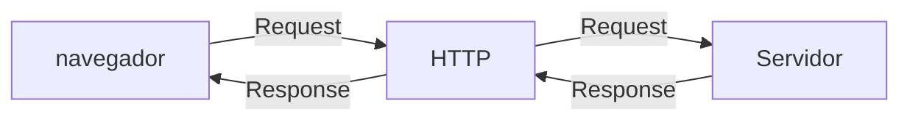

# Curso BackEnd - 1º Semestre - 105h

prof. Diogo Barbosa

Escola SENAI Americana

2º Semestre

## Objetivos do Curso 

 - Desenvolver Aplicações web Serve Side, Utilizando a Linguagem PHP;
 - Aplicar Sintaxe nativa Php Vanilla;
 - Manipulação HTTP;
 - Persistência (armazenamento em BD);
 - Segurança contra SQL Ijection/CSRF;
 - Refatoração em POO (Programação Orientada Objeto);
 - Arquitetura MVC;
 - Utilização do FrameWork Laravel;
 
## Cronograma do Semestre

Carga Horária: 105h

Duração: 20 Semanas

### Introdução ao BackEnd e Configuração do Ambiente PHP

#### o que é BackEnd 

```https://dontpad.com/diogotb``` site do diogo para entar no live share 

O back-end é a parte de um site ou aplicativo que o usuário não vê, mas que faz tudo funcionar por trás das telas.

- Guarda e organiza informações em um banco de dados;
- Confere se o login e a senha estão corretos;
- Calcula valores, como o frete ou o total de uma compra;
- Garante que os dados de um usuário não apareçam para outro;
- Faz o sistema suportar muitas pessoas usando ao mesmo tempo, sem travar.

As principais linguagens utilizadas no desenvolvimento back-end são PHP, JavaScript/TypeScript, Python, Java, Kotlin, Go (Golang), C# e Rust. 

O backend é o "cérebro" oculto de um site ou aplicativo. Ele roda em um servidor e cuida de tudo o que o usuário não vê na tela.

**As 3 partes básicas de todo backend:**

1. **Servidor:** o "computador" que fica ligado esperando pedidos (requisições);
2. **Banco de dados:**  onde as informações ficam guardadas (usuários, produtos, mensagens, etc.);
3. **Lógica de negócio:**  as regras do sistema (ex: "não deixa comprar se não tiver estoque").

**O Mercado de Trabalho em Back-end**

O desenvolvimento Back-end é uma das áreas mais cruciais da Tecnologia da Informação. 

- Com a transformação digital acelerada, empresas de todos os portes e setores dependem de infraestruturas sólidas e seguras. 

- Setores de Atuação: Bancos, hospitais, e-commerces, logística, indústrias, startups e órgãos públicos utilizam Back-end para suportar suas operações críticas.

- Fatores de Crescimento: O avanço da computação em nuvem, aplicativos móveis, Big Data e IA impulsiona continuamente a busca por profissionais da área.

- Modelos de Trabalho: Alta flexibilidade com vagas presenciais, híbridas e remotas (inclusive com oportunidades internacionais).

#### Ciclo de vida da requisição HTTP

##### O que é HTTP 

**HTTP**, Hypertext Transfer Protocol, é um protocolo de comunicação utilizado para transferência de informações na WWW(World Wide Web) e em outros sistemas de Redes.

O HTTP é a base para que o cliente e um servidor web troquem informações. ele permite a requisição e a respostas de recursos, como imagens, arquivos e as próprias páginas web, por meio de mensagens padrão (protocolo).

#### Como Funciona  o HTTP 

1. O cliente estabelece o contato com o servidor, encaminhando uma requisição HTTP;
2. nesse Requisição o cliente especifica o método pretendido (read-GET, create-POST, update-PUT/PATCH, delete-DELETE);
3. O servidor processa e responde com uma mensagem HTTP, com os recursos  solicitado.


---

#### Como Funciona na Prática o BackEnd

- **Ação do Usuário**: Envia uma Solicitação pela UI(Interface do Usuário). Exemplo de UI: Tela do Celular, Navegador da Internet, Alexa ...
- **envio do resição**: a UI transforma ação do Usuário em uma requisição: A UI transforma ação do Usuário em uma Requisição HTTP
- **O Processamento BackEnd**: o Código Backend recebe o pedido, valida os dados e decide o que fazer (Ex: consulta uma informação no banco de dados)
- **Resposta**: O  Servidor devolver o resultado para a UI (EX. em Login autorizado, uma compra confirmada, )

---

#### Tipos de Requisição HTTP

Os tipos de de requisição HTTP indicam a ação que o usuário deseja executar no servidor. As principais ações são:

- **GET**: pede dados de um lugar especifico. "Não faz alterações mo servidor"
- **POST**: Enviar dados novos para *criar* algo ou processsar informações.
- **PUT/PATCH**: Modificar dados já existentes. *PUT* Atualização Total dos dados. *PATCH* Atualização Parcial dos dados.
- **DELETE**: Apaga um dado do servidor.
---

#### iniciando o PHP

#### O que é PHP 

**PHP** (Hypertext preprocessor) é uma linguagem de programação interpretada e open surce, Focada no desenvolvimento de sistemas para web, pode ser usada junto com HTML para criação de páginas web dinâmicas.

#### Instalando o PHP 

- Fazer o download do PHP (php.net);
- ZIP - non thread Safe 8.5 
- descopactar o arquivo do PHP na pasta C:\src\php (Para descompactar, usar o 7Zip = Melhor)
- modificar o arquivo php.ini -development para => php.ini (criar as configurações do PHP na máquina) - adicionar ou remover funcionalidade do PHP
- Adicionar a pasta do PHP(C:\src\php) as variaveis de ambiente do Sistema (PATH)
- verificar a instalação rodando o Comando php --version 

##### Contextualizando o PHP

o PHP de fato é uma das linguagens de Programção mais populares da atualizada. Ela permite que você crie aplicações web robustas, de uma maneira muito simplifica e direto ao ponto.
sem contar que a linguagem traz diversos recursos que facilitam e aceleram o processo de desenvolvimento de sites e sistemas par web.E alêm do mais, ela ainda tem um ótimo ecossitema, uma excelente comunidade e um grande mercado de trabalho. 

##### Criando minha primeira aplicação em PHP

criando um Hello, World!!!

##### Criando o perfil de PHPVanilla 

-> Profile -> new profile 
-> Extensions:
- PHP interPhense( Ado Elefantinho): AutoCompletar (Snipets)
- PHP Debug (Xdebug): acha Erros em Linha de Código
- PHP CS FIXER: Formatação padrão do código (Identação)
- PHP Server: Sobre um servidor Local para Acompanhamento em Tempo Real

##### Estudo de Variáveis e constantes em PHP

declarar variáveis é alocar um espaço na memoria que permite a inclusão e manipulação de dados.

**Variaveis**

- devem ser declaradas usando "$" antes do nome da variável
- podem ser String, Numérica (Integer e Float), Booleanas e Nulas. Não permite declaração de UndeFined
- São não tipadas ( não precisa declara o tipo na criação), a tipagem é atribuida ao adicionar o valor
- Usar o "declare(strict_types=1);" na primeira linha do arquivo ; => blindar o sistema contra conflitos de tipos de Variáveis.

**Constantes**

- não podem ser modificadas ou redeclaradas
após a criação
- pode ser criada usando "const" ou "define"
- não permitem interpolação 

##### Estudo de Operadores

**Aritméticos**: São usados para realizar cálculos.

| Operador | Nome | Exemplo | Resultado |
| - | - | - | - |
| + | Adição | 10 + 5 | 15
| - | subtração | 10 - 5 | 5 |
| * | Multiplicação | 10 * 5 | 50 |
| / | Divisão | 10 / 5 | 2 |
| % | módulo (resto) | 10 % 3 | 1 (10 div 3 da 3, sobra 1) |
| ** | Expoente | 2 ** 3 | 8(2 elevado a 3) |

obs: O Operador % é o melhor amigo de um programador, permite ordenar listas e porganizar fila e pilhas

##### Estudo dos Relacionais 

Usados para comparar valores e retornar se é **true** e **false**

| Nomes | Operador | Exemplo | Resultado | 
| - | - | - | - | 
| Iguais  | == | "10" == 10 | true |
| Igualdade Escrita | === | "10" === 10 | false |
| Diferente | != | "10" != | false |
|diferença estrita | !== | "10"!==10 | true |
| Maior que | > | 18 > 18 | false | 
| Menor que | < | 10 < 20 | true |
| Maior ou Igual | >= | 18 >= 18 | true |
| Menor ou igual | <= | 10 <= 5 | false |

**Lógicos**: Permite a combinação entre sentenças.

- operador AND (&) => && : para o resultado se verdadeiro, TODAS as combinaçães precisam ser verdadeiras
  - true && true => true
  - true && false => false
- Operador OR (OU) => || : Basta APENAS UMA condição ser verdadeira
  - false || true => true
  - false || false => false

- Operador NOT (Não) => ! : Inverte a lógica da Sentença
  - !true => false
  - !false => true
