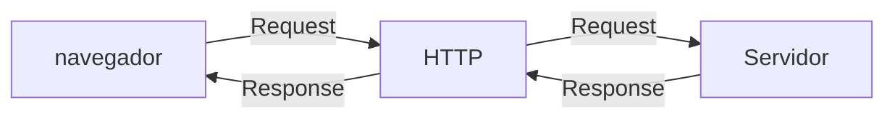

# Curso BackEnd - 1º Semestre - 105h

prof. Diogo Barbosa

Escola SENAI Americana

2º Semestre

## Objetivos do Curso 

 - Desenvolver Aplicações web Serve Side, Utilizando a Linguagem PHP;
 - Aplicar Sintaxe nativa Php Vanilla;
 - Manipulação HTTP;
 - Persistência (armazenamento em BD);
 - Segurança contra SQL Ijection/CSRF;
 - Refatoração em POO (Programação Orientada Objeto);
 - Arquitetura MVC;
 - Utilização do FrameWork Laravel;
 
## Cronograma do Semestre

Carga Horária: 105h

Duração: 20 Semanas

### Introdução ao BackEnd e Configuração do Ambiente PHP

#### o que é BackEnd 

O back-end é a parte de um site ou aplicativo que o usuário não vê, mas que faz tudo funcionar por trás das telas.

- Guarda e organiza informações em um banco de dados;
- Confere se o login e a senha estão corretos;
- Calcula valores, como o frete ou o total de uma compra;
- Garante que os dados de um usuário não apareçam para outro;
- Faz o sistema suportar muitas pessoas usando ao mesmo tempo, sem travar.

As principais linguagens utilizadas no desenvolvimento back-end são PHP, JavaScript/TypeScript, Python, Java, Kotlin, Go (Golang), C# e Rust. 

O backend é o "cérebro" oculto de um site ou aplicativo. Ele roda em um servidor e cuida de tudo o que o usuário não vê na tela.

**As 3 partes básicas de todo backend:**

1. **Servidor:** o "computador" que fica ligado esperando pedidos (requisições);
2. **Banco de dados:**  onde as informações ficam guardadas (usuários, produtos, mensagens, etc.);
3. **Lógica de negócio:**  as regras do sistema (ex: "não deixa comprar se não tiver estoque").

**O Mercado de Trabalho em Back-end**

O desenvolvimento Back-end é uma das áreas mais cruciais da Tecnologia da Informação. 

- Com a transformação digital acelerada, empresas de todos os portes e setores dependem de infraestruturas sólidas e seguras. 

- Setores de Atuação: Bancos, hospitais, e-commerces, logística, indústrias, startups e órgãos públicos utilizam Back-end para suportar suas operações críticas.

- Fatores de Crescimento: O avanço da computação em nuvem, aplicativos móveis, Big Data e IA impulsiona continuamente a busca por profissionais da área.

- Modelos de Trabalho: Alta flexibilidade com vagas presenciais, híbridas e remotas (inclusive com oportunidades internacionais).

#### Ciclo de vida da requisição HTTP

##### O que é HTTP 

**HTTP**, Hypertext Transfer Protocol, é um protocolo de comunicação utilizado para transferência de informações na WWW(World Wide Web) e em outros sistemas de Redes.

O HTTP é a base para que o cliente e um servidor web troquem informações. ele permite a requisição e a respostas de recursos, como imagens, arquivos e as próprias páginas web, por meio de mensagens padrão (protocolo).

#### Como Funciona  o HTTP 

1. O cliente estabelece o contato com o servidor, encaminhando uma requisição HTTP;
2. nesse Requisição o cliente especifica o método pretendido (read-GET, create-POST, update-PUT/PATCH, delete-DELETE);
3. O servidor processa e responde com uma mensagem HTTP, com os recursos  solicitado.

#### iniciando o PHP

#### O que é PHP 

**PHP** (Hypertext preprocessor) é uma linguagem de programação interpretada e open surce, Focada no desenvolvimento de sistemas para web, pode ser usada junto com HTML para criação de páginas web dinâmicas.

#### Instalando o PHP 

- Fazer o download do PHP (php.net);