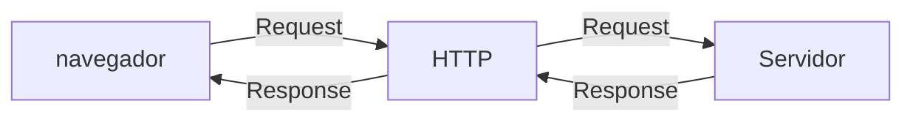
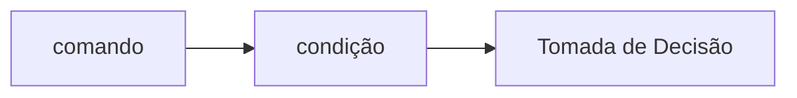
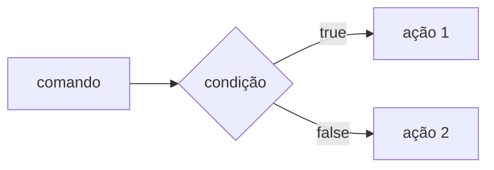
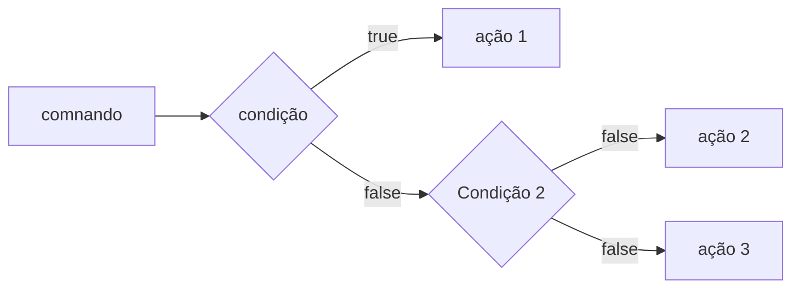
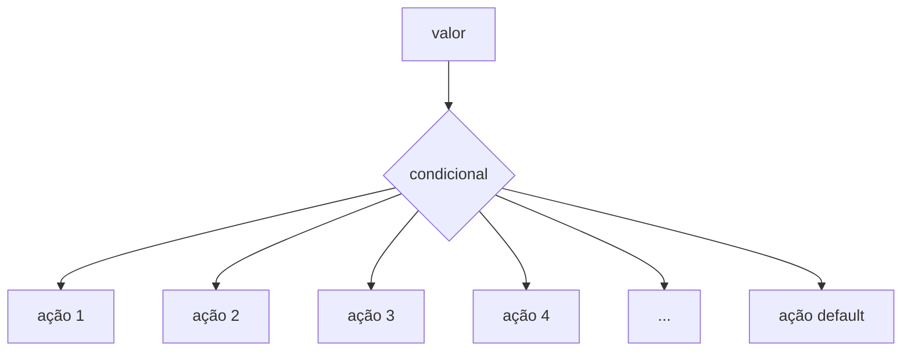
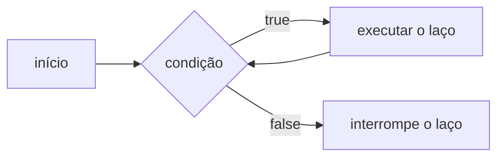

# Curso BackEnd - 1º Semestre - 105h

prof. Diogo Barbosa

Escola SENAI Americana

2º Semestre

## Objetivos do Curso 

 - Desenvolver Aplicações web Serve Side, Utilizando a Linguagem PHP;
 - Aplicar Sintaxe nativa Php Vanilla;
 - Manipulação HTTP;
 - Persistência (armazenamento em BD);
 - Segurança contra SQL Ijection/CSRF;
 - Refatoração em POO (Programação Orientada Objeto);
 - Arquitetura MVC;
 - Utilização do FrameWork Laravel;
 
## Cronograma do Semestre

Carga Horária: 105h

Duração: 20 Semanas

### Introdução ao BackEnd e Configuração do Ambiente PHP

#### o que é BackEnd 

```https://dontpad.com/diogotb``` site do diogo para entar no live share 

O back-end é a parte de um site ou aplicativo que o usuário não vê, mas que faz tudo funcionar por trás das telas.

- Guarda e organiza informações em um banco de dados;
- Confere se o login e a senha estão corretos;
- Calcula valores, como o frete ou o total de uma compra;
- Garante que os dados de um usuário não apareçam para outro;
- Faz o sistema suportar muitas pessoas usando ao mesmo tempo, sem travar.

As principais linguagens utilizadas no desenvolvimento back-end são PHP, JavaScript/TypeScript, Python, Java, Kotlin, Go (Golang), C# e Rust. 

O backend é o "cérebro" oculto de um site ou aplicativo. Ele roda em um servidor e cuida de tudo o que o usuário não vê na tela.

**As 3 partes básicas de todo backend:**

1. **Servidor:** o "computador" que fica ligado esperando pedidos (requisições);
2. **Banco de dados:**  onde as informações ficam guardadas (usuários, produtos, mensagens, etc.);
3. **Lógica de negócio:**  as regras do sistema (ex: "não deixa comprar se não tiver estoque").

**O Mercado de Trabalho em Back-end**

O desenvolvimento Back-end é uma das áreas mais cruciais da Tecnologia da Informação. 

- Com a transformação digital acelerada, empresas de todos os portes e setores dependem de infraestruturas sólidas e seguras. 

- Setores de Atuação: Bancos, hospitais, e-commerces, logística, indústrias, startups e órgãos públicos utilizam Back-end para suportar suas operações críticas.

- Fatores de Crescimento: O avanço da computação em nuvem, aplicativos móveis, Big Data e IA impulsiona continuamente a busca por profissionais da área.

- Modelos de Trabalho: Alta flexibilidade com vagas presenciais, híbridas e remotas (inclusive com oportunidades internacionais).

#### Ciclo de vida da requisição HTTP

##### O que é HTTP 

**HTTP**, Hypertext Transfer Protocol, é um protocolo de comunicação utilizado para transferência de informações na WWW(World Wide Web) e em outros sistemas de Redes.

O HTTP é a base para que o cliente e um servidor web troquem informações. ele permite a requisição e a respostas de recursos, como imagens, arquivos e as próprias páginas web, por meio de mensagens padrão (protocolo).

#### Como Funciona  o HTTP 

1. O cliente estabelece o contato com o servidor, encaminhando uma requisição HTTP;
2. nesse Requisição o cliente especifica o método pretendido (read-GET, create-POST, update-PUT/PATCH, delete-DELETE);
3. O servidor processa e responde com uma mensagem HTTP, com os recursos  solicitado.


---

#### Como Funciona na Prática o BackEnd

- **Ação do Usuário**: Envia uma Solicitação pela UI(Interface do Usuário). Exemplo de UI: Tela do Celular, Navegador da Internet, Alexa ...
- **envio do resição**: a UI transforma ação do Usuário em uma requisição: A UI transforma ação do Usuário em uma Requisição HTTP
- **O Processamento BackEnd**: o Código Backend recebe o pedido, valida os dados e decide o que fazer (Ex: consulta uma informação no banco de dados)
- **Resposta**: O  Servidor devolver o resultado para a UI (EX. em Login autorizado, uma compra confirmada, )

---

#### Tipos de Requisição HTTP

Os tipos de de requisição HTTP indicam a ação que o usuário deseja executar no servidor. As principais ações são:

- **GET**: pede dados de um lugar especifico. "Não faz alterações mo servidor"
- **POST**: Enviar dados novos para *criar* algo ou processsar informações.
- **PUT/PATCH**: Modificar dados já existentes. *PUT* Atualização Total dos dados. *PATCH* Atualização Parcial dos dados.
- **DELETE**: Apaga um dado do servidor.
---

#### iniciando o PHP

#### O que é PHP 

**PHP** (Hypertext preprocessor) é uma linguagem de programação interpretada e open surce, Focada no desenvolvimento de sistemas para web, pode ser usada junto com HTML para criação de páginas web dinâmicas.

#### Instalando o PHP 

- Fazer o download do PHP (php.net);
- ZIP - non thread Safe 8.5 
- descopactar o arquivo do PHP na pasta C:\src\php (Para descompactar, usar o 7Zip = Melhor)
- modificar o arquivo php.ini -development para => php.ini (criar as configurações do PHP na máquina) - adicionar ou remover funcionalidade do PHP
- Adicionar a pasta do PHP(C:\src\php) as variaveis de ambiente do Sistema (PATH)
- verificar a instalação rodando o Comando php --version 

##### Contextualizando o PHP

o PHP de fato é uma das linguagens de Programção mais populares da atualizada. Ela permite que você crie aplicações web robustas, de uma maneira muito simplifica e direto ao ponto.
sem contar que a linguagem traz diversos recursos que facilitam e aceleram o processo de desenvolvimento de sites e sistemas par web.E alêm do mais, ela ainda tem um ótimo ecossitema, uma excelente comunidade e um grande mercado de trabalho. 

##### Criando minha primeira aplicação em PHP

criando um Hello, World!!!

##### Criando o perfil de PHPVanilla 

-> Profile -> new profile 
-> Extensions:
- PHP interPhense( Ado Elefantinho): AutoCompletar (Snipets)
- PHP Debug (Xdebug): acha Erros em Linha de Código
- PHP CS FIXER: Formatação padrão do código (Identação)
- PHP Server: Sobre um servidor Local para Acompanhamento em Tempo Real

##### Estudo de Variáveis e constantes em PHP

declarar variáveis é alocar um espaço na memoria que permite a inclusão e manipulação de dados.

**Variaveis**

- devem ser declaradas usando "$" antes do nome da variável
- podem ser String, Numérica (Integer e Float), Booleanas e Nulas. Não permite declaração de UndeFined
- São não tipadas ( não precisa declara o tipo na criação), a tipagem é atribuida ao adicionar o valor
- Usar o "declare(strict_types=1);" na primeira linha do arquivo ; => blindar o sistema contra conflitos de tipos de Variáveis.

**Constantes**

- não podem ser modificadas ou redeclaradas
após a criação
- pode ser criada usando "const" ou "define"
- não permitem interpolação 

---

### ### Semana 2 - Operadores em PHP (Aritméticos, Relacionais e Lógicos)

##### Estudo de Operadores

**Aritméticos**: São usados para realizar cálculos.

| Operador | Nome | Exemplo | Resultado |
| - | - | - | - |
| + | Adição | 10 + 5 | 15
| - | subtração | 10 - 5 | 5 |
| * | Multiplicação | 10 * 5 | 50 |
| / | Divisão | 10 / 5 | 2 |
| % | módulo (resto) | 10 % 3 | 1 (10 div 3 da 3, sobra 1) |
| ** | Expoente | 2 ** 3 | 8(2 elevado a 3) |

obs: O Operador % é o melhor amigo de um programador, permite ordenar listas e porganizar fila e pilhas

##### Estudo dos Relacionais 

Usados para comparar valores e retornar se é **true** e **false**

| Nomes | Operador | Exemplo | Resultado | 
| - | - | - | - | 
| Iguais  | == | "10" == 10 | true |
| Igualdade Escrita | === | "10" === 10 | false |
| Diferente | != | "10" != | false |
|diferença estrita | !== | "10"!==10 | true |
| Maior que | > | 18 > 18 | false | 
| Menor que | < | 10 < 20 | true |
| Maior ou Igual | >= | 18 >= 18 | true |
| Menor ou igual | <= | 10 <= 5 | false |

**Lógicos**: Permite a combinação entre sentenças.

- operador AND (&) => && : para o resultado se verdadeiro, TODAS as combinaçães precisam ser verdadeiras
  - true && true => true
  - true && false => false
- Operador OR (OU) => || : Basta APENAS UMA condição ser verdadeira
  - false || true => true
  - false || false => false

- Operador NOT (Não) => ! : Inverte a lógica da Sentença
  - !true => false
  - !false => true

### Semana 3 - Estrutura de controle de Dados (condicionais e Repetição)

- **Conteúdo**: Estruturas `if`, `else`, `elseif`, Operadores ternários, `match`, loops `for`, `while` `do-while` e `foreach`

#### Estrutura de controle de Dados ajudam no processo de automatização e, programas e sistemas

##### Condicionais (IF, ELSE, ELSEIF)

- **forma de uso**:

- uso do `if` apenas 
exemplo:aplicar um desconto de 10% em comrpas acima de 100 Reais; 



```php
if ($valorCompra > 100) {
  $valorCompra = $valorCompra * 0.1
}
```

- Uso do `if` e do `else`
Exemplo: Aplicar um desconto 10% para compras acima de 100 reais e 5% para as demais compras 



```php

if($valorCompra > 100) {
  $valorFinal = $valorCompra * 0.1
} else{
  $valorFinal = $valorCompra * 0.05;
}


```

- Uso do `elseif` (Encadeado)
Exemplo: Compras acima de 200 reais tem 15% de desconto, acima de 100 reais tem 10% de desconto e outras 5% de desconto



```php

if ($valorCompra > 200){
  $valorFinal = $valorCompra * 0.85;
} elseif($valorCompra > 100) {
  $valorFinal - $valorCompra * 0.9;
}else {
  $valorFinal = $valorCompra * 0.95;
}

```

*obs*: sempre usar `elseif` para situações que precisam de mais de uma condição, ou seja fazer encadeamento das condições.

- Uso **ERRADO** do if

Não fazer o encadeamento de condicionais 

```php

if($valorCompra > 200) {
  $valorFinal = $valorCompra*0.85;
}

if($valorCompra > 100) {
  $valorFinal = $valorCompra*0.90;
}

if($valorCompra > 100) {
  $valorFinal = $valorCompra*0.95;
}

```


##### Operadores ternários 
Um atalho para a estrutura condicional `if/else`, normalmente escrito em uma única linha de código

` condição ? verdadeira : falso `

perfeito para decições curtas de uma linha de comando
Exemplo: Verificar se Pessoa é maior de idade (18)

```php

$idade = 20;
//O formato é : (Condição) ? Verdadeira : Falso;

$status = ($idade >= 18) ? "Maior de Idade" : "Menor de idade";
$status2 = ($idade<18) ? "Criança" : ($idade<60) ? "Adulto" : "Idoso";

```

##### Expressão Condicional `match` (PHP 8)

No mercado de PHP atual, não se usa mais ema dezena de `if/else`
checar valores fixos, e o antigo `Seitch/case` caiu em desuso. Usamos o `match`. Ela compara um valor e retona diretamnete o resultado.



```php

$diaSemana = date("Week"); // pega o Dia da Semana em formato numérico

//Transforma dia da Semana em formato texto (Domingo, Segunda,...)

$nomeDiaSemana = match($diaSemana){
  "0" => "Domingo",
  "1" => "Segunda",
  "2" => "Terça",
  "3" => "Quarta",
  "4" => "Quinta",
  "5" => "Sexta",
  "6" => "Sábado",
  default => "Dia inválido"
};

```

---

##### Laços de Repetição 

Um laço de repetição faz com que, um bloco de códigos rode várias vezes, até que uma condição mande parar.

- O laço `while` (Enquanto)

Ele verifica se condição é verdadeira ANTES de entrar no laço. ideal quando você não sabe quantas vezes vai rodar o laço.



exemplo: Jogo de adivinhação de um nº Secreto

```php

$numeroSecreto = rand(1,10);

$tentativas = 0;

while($tentativa != $numeroSecreto){
  echo "tente novamente"
  //vou pegar um nº aleatório entre 1 e 10
  $tentativa = rand(1,10);
}

echo "acertou Miseravi !!! o nº secreto é $numeroSecreto";

```

 - O laço `do-while` (faça-Enquanto)

 a diferença é que ele execua o bloco pelo menos uma vez, mesmo que a condição seja falsa desde o início, pois ele só pergunta no final

 ```mermaid

 flowchart LR

A([Início]) --> B[Executar Ação]
B --> C{Condição}
C --true--> B
C --false--> D([Fim]) 

```

exemplo: jogo de adivinhação

```php

$numeroSecreto = rand(1,10);

do {
  $tentativa = rand(1,10);// Simular um palpite aleatório

  if($tentativa == $numeroSecreto){
    echo "parabéns, acertou!!!!";
    }

    } while ($tentativa != $numeroSecreto);

```

obs: Uso ideal do `d-while`, Menus de sistema ou sistema de solicitações de dados, siste,as interativos,

---

##### O Freio de Emergência: `break` e `continue`

As vezes precisamoso interferir no laço enquanto ele está rodando 

- `break`=> **Para Tudo!** Quebra o laço interiro e avai embora
- `continue` => **Pula a rodada!** Ele ignora o código daquela rodada especifica e pula logo par a próxima repetição.

Exemplo de Aplicação do Código: Sistema de Controle do Elevador

```php 

for($andar = 1 ; $andar<=10; $andar++){
    if($andar ==4){
        echo "Andar $andar está em obras. Passando direto!";
        continue;
    }

    echo "Elevador parou no andar $andar"
}

```
---

##### Laço de Repetição `for`

Use o `for`quando você sabe quanats vezes precisa repetir uma ação ou quando precisa conrolar um contador. ele possui 3 partes:

 - inicialização;
 - condição;
 - incremento;

 Sintaxe:

 for(inicialização; Condição; Incremeno) {
    ação
 }

 ```mermaid
 flowchart LR
      A[início: i=0] --> B{i<10?}
      B --true--> C[Ação]
      C --> D[i++]
      B --false--> E[FIM]
```

Exemplo de aplocação: Exibir todos os Meses do ano

```php
fo($mes=1;$mesM<=12;$mes++){
  echo "Mês $mes";
}
```
Nesse Exemplo, `$mes` começa em 1, o laço continua enquanto `$mes` for menor ou igual a 12 e, ao final de cada repetição, `mes` aumenta o contador em 1

##### Laço de Repetição `foreach`

use o `foreach` qaundo precisar percorrer cada item de um **array**. ele acessa os elementos diretamente, sem que você precise controlar o contador.

exemplo: imprimir todos os itens de um vetor.

```php
$frutas = ["maça", "banana", "uva", "laranja"];

foreach($frutas as $fruta){
  echo "fruta: $fruta";
}
```
Outro exemplo: Acessar a chave e o valor de cada intem:

```php
$preços = [
  "caderno" => 25.00,
  "caneta" => 5.50,
  "mochila" => 99.00
]; //vetor não ordenado do tipo Chave(key) => Valor(Value) ===> Coleção/Dicionário

//percorrer o vetor usando o laço foreach
foreach($precos as $produto => $preço) {
  echo "$produto: R$" . number_format($prco,2);
}
// acessa a chave e o valor de cada item do vetor
```

---
---

#### Desafio: Simulador de cobrança(FINASENAI)

#### Desafio Final
---
---

### Semana 4 - Modularização com funções

#### Principio do DRY (Don´t repeat yourself)

se uma lógica foi escrita duas ou mais vezes dentro de um código, essa lógica deve virar uma função.


#### Funções Nativas do PHP

o PHP tem milhares de funções prontas, essa função já criada é chamada de função nativa.

 - **o que é uma função?**

 uma função é como uma máquina: você coloca a matéria-prima(Parâmetros), ela processa e devolve um produto final (retorno)

 Exemplo de função Nativa 

 ```php
 $texto = "senai americana";

 // usar uma função nativa para substituição de parte do texto ==> str_replace
 $textoNovo = str_replace("americana", "são paulo", $texto);
 // "senai são paulo"

 //usar uma função nativa para substituição das letras minúsculas por letras maiúsculas  => strtoupper
 echo strtoupper($textonovo);//SENAI SÃO PAULO
 ```

##### Principais funções Nativas (Mais Utilizadas)

As funções abaixo já fazem parte do PHP e podem ser chamadas diretamente no código. Observe os parâmetros que cada uma recebe e o tipo de informação que ela retorna.

| Função | Categoria | O que faz | Como usar |
|---|---|---|---|
| `strlen()` | Strings | Retorna a quantidade de caracteres de um texto. | `$tamanho = strlen($texto);` |
| `strtoupper()` | Strings | Converte o texto para letras maiúsculas. | `$resultado = strtoupper($texto);` |
| `strtolower()` | Strings | Converte o texto para letras minúsculas. | `$resultado = strtolower($texto);` |
| `ucfirst()` | Strings | Converte a primeira letra do texto para maiúscula. | `$resultado = ucfirst($texto);` |
| `trim()` | Strings | Remove espaços e quebras de linha no início e no fim do texto. | `$limpo = trim($texto);` |
| `str_replace()` | Strings | Substitui uma parte do texto por outra. | `$novo = str_replace("-", "", $cpf);` |
| `substr()` | Strings | Extrai uma parte do texto a partir de uma posição. | `$inicio = substr($texto, 0, 3);` |
| `explode()` | Strings | Divide um texto e cria um array usando um separador. | `$palavras = explode(" ", $nome);` |
| `implode()` | Arrays | Junta os itens de um array em um único texto. | `$lista = implode(", ", $nomes);` |
| `count()` | Arrays | Conta a quantidade de itens de um array. | `$total = count($produtos);` |
| `in_array()` | Arrays | Verifica se um valor existe dentro de um array. | `$existe = in_array("SP", $estados, true);` |
| `array_push()` | Arrays | Adiciona um ou mais itens ao final de um array. | `array_push($nomes, "Ana");` |
| `array_pop()` | Arrays | Remove e retorna o último item de um array. | `$ultimo = array_pop($nomes);` |
| `sort()` | Arrays | Ordena um array em ordem crescente e reorganiza suas chaves. | `sort($notas);` |
| `array_keys()` | Arrays | Retorna um array contendo as chaves de outro array. | `$chaves = array_keys($produtos);` |
| `number_format()` | Números | Formata um número com casas decimais e separadores definidos. | `$preco = number_format($valor, 2, ',', '.');` |
| `round()` | Números | Arredonda um número para a quantidade de casas informada. | `$media = round($nota, 2);` |
| `max()` | Números | Retorna o maior valor de uma lista ou array. | `$maior = max($notas);` |
| `min()` | Números | Retorna o menor valor de uma lista ou array. | `$menor = min($notas);` |
| `is_numeric()` | Validação | Verifica se o valor é um número ou uma string numérica. | `if (is_numeric($entrada)) { ... }` |
| `isset()` | Validação | Verifica se uma variável existe e não possui valor `null`. | `if (isset($usuario)) { ... }` |
| `empty()` | Validação | Verifica se uma variável está vazia. | `if (empty($pedido)) { ... }` |
| `date()` | Data e hora | Formata uma data ou hora conforme uma máscara. | `$hoje = date('d/m/Y');` |
| `file_exists()` | Arquivos | Verifica se um arquivo ou diretório existe. | `if (file_exists('dados.txt')) { ... }` |
| `file_get_contents()` | Arquivos | Lê todo o conteúdo de um arquivo ou endereço. | `$conteudo = file_get_contents('dados.txt');` |
| `file_put_contents()` | Arquivos | Grava conteúdo em um arquivo, criando-o se necessário. | `file_put_contents('log.txt', $mensagem);` |

**Atenção:** algumas funções modificam o array original, como `sort()`, `array_push()` e `array_pop()`. Já outras retornam um novo valor, como `count()`, `explode()` e `str_replace()`. Em caso de dúvida, consulte a documentação oficial do PHP e verifique o retorno da função.


##### Documentação PHP

[acesse a documentação oficial do PHP em português](https://www.php.net/manual/pt_BR/)

Consulte também a [referência de funções do PHP em ](https://www.php.net/manual/pt_BR/funcref.php) para pesquisa a sintaxe, osparâmetros e os valores para cada função.

#### Funções Customizadas (Criando suas próprias máquinas)

quando o PHP não tem a função que queremos, nós a criamos!

**A Regra de ouro**: Uma função deve focar em `return` (retornar um valor), e não imprimir (`echo`).

Veja a diferença nesse exemplo:

```php
function calcularTotal($preco, $quantidade){
  // a função calcula e retorna o resultado, mas não imprimi nada
  return $preco * $quantidade;
}

$total = calcularTotal(25.00, 3);

//imprimir é feito fora da função
echo "Total da compra: R$ " .round($total,2);
// Total da compra: R$ 75.00
```

A função `calcularTotal()` pode ser reutilizada em uma página, relatório ou teste. O `echo` aparece somente fora da função, no momento de apresentar o resultado para o usuário.

##### Padrão de uso corporativo (PHP 8 Strit types)

no mercado de trabalho, exigimos que a função avise exatamente o **TIPO** de dado que ela espera  receber e o **TIPO** de dado que ela vai devolver.

isso é chamado de **tipagem de funções**. ao declarar os tipos, o código fica mais fácil de entender e o PHP consegue identificar alguns erros antes que eles causem problemas maiores no sistema.

Os tipos mais usados:

*`int`: número inteiro, `10` ou `1024`;
*`float`:número decimal ou ponto flutuante, `10.90`;
*`string`: Texto, como `"Maria"`;
*`bool`: valor lógico, `true` ou `false`;
*`void`: identificar que a função não devolve nenhum valor;

O tipo deve ser escrito antes do nome de cada parâmetro e o tipo da função deve ser escrito após os parênteses, precedido do ":", informando o que a função vai devolver 

Exemplo de uso de função e parâmetros tipados:

```php
function apresentasProduto(string $nome, float $preço): string{
  return "$nome custa R$ $precp";
}

$mensagem = apresenatrproduto("caderno", 25.00);
echo $mensagem;
// Caderno custa R$ 25.90
```

>**Resumo**: os tipos dos parâmetros documentam as entradas da função, o tipo após `:` documenta a saída da função.

##### O tipo Mágico: `VOID`

se uma função faz um trablho interno e **não retorna NADA**,
dizemos que o retorno dela é "vazio" (`void`).

Exemplo de função sem retorno:

```php
function registraLog(string $mensagem): void{
  //apenas salva em um arquivo de texto, não devolve nenhuma variável
  file_put_contents("erro.log",$mensagem);

}
```

#### Escopo e Referencia (o Segredo da Memória)

##### O que é Escopo? (A Regra de Las Vegas)

*O que acontece dentro da função, fica dentro da função*. Uma variável criada fora não existe la dentro, e uma criada lá dentro morre quando a função acaba.

**Escopo** é o local do programa onde a variável pode ser armazenada/acessada. Em PHP, uma variável criada fora de uma função pertece ao *escopo global*, uma variável criada dentro de uma função pertende ao *escopo local*.

Exemplo de Escopo de variável:

```php 
$nomeSistema = "CRM SENAI";//variável global

function criarMensagem(string $nome): string{
  $mensagem = "Bem-vindo!!!";//escopo Local
  return $mensagem . $nome;
}

echo $nomeSistema; //correto: esta no escopo global
//echo $mensagem;//Errado: $mensagem só existe dentro da função, não é acessada fora
echo criarMensagem("nome do fulano")//correto: A função devolve sua variável local
//CSM SENAI
//Bem-bindo! nome do fulano
```

*como enviar Dados para uma função*

A forma mais segura e organizada é envirar os dados por **Parâmetros**. Assim, a função precisa acessar diretamente variáveis globais:

```php

function saudar(string $nome):string {
  return "Olá, $nome!";
}

$nomeCliente = "joão";
echo saudar($nomeCliente);// Olá, joão
```

nesse caso , `$nomeCliente` continua no escopo global, mas seu valor é enviado para parâmetro local `$nome`. Afunção recebe uma informação, processa e retorna o resultado.

**Exemplo Incorreto**

```php
$nome = "joão"; //variável global

function saudar() :string{
  return "Olá, $nome";//Errado: a função não reconhece a variável global
}
```
A função `saudar()`não conhece a variável global `$nome`. Ocasionando um erro no sistema.

> **Resumo**: variáveis protegem os dados internos da função; parâmetros são o caminho recomendado para evitar Erros e enviar Informações, e `return`é usado para devolver um resultado ao códgio que chamou a função.
